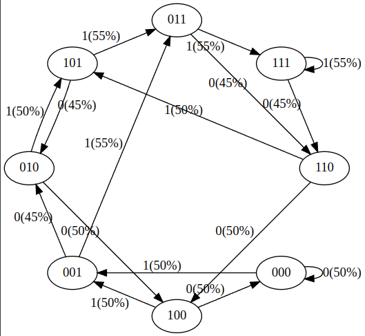

# let's gameify dataset generation and distributed model training with something like brainfuckGPT
This is all a proof of concept of ideas that I've been dreaming on since I read [finite state gpt](https://colab.research.google.com/drive/1SiF0KZJp75rUeetKOWqpsA8clmHP6jMg?usp=sharing#scrollTo=yseminfTx52k&uniqifier=2).

[000, 001, 010, 011, 100, 101, 110, 111]

[spaghettiGPT.py](./spaghettiGPT.py) demonstrates the speed and efficiency with which brainfuckGPT can ejaculate invalid Brainfuck

[brainfuckGPT.html](./brainfuckGPT.html) is a work in progress.  The goal is to gameify data generation and model training.

## Questions to explore
 *What's the simplest way to get valid Brainfuck out of a neural network of similar size to finite-state-gpt?*